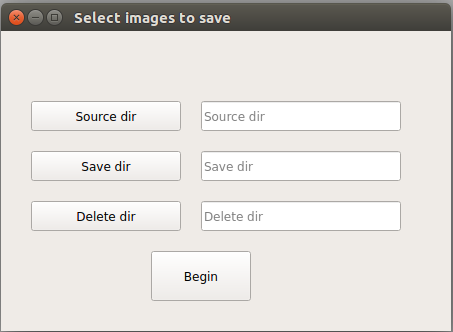
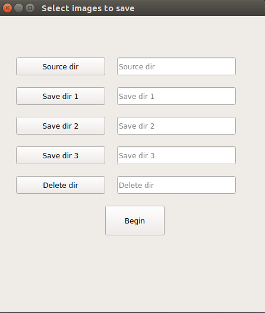

# Python Version: python3

# V2
## short-cut key:

save - 's' or 'Space'

prev - 'a'

next - 'Enter' or 'd' 

quit - 'q'

dele - 'Del'

# v3
## short-cut key:

save (default dir1) - 's' or 'Space'

save dir2 - 'd' 

save dir3 - 'f'

prev - 'a'

next - 'Enter' 

quit - 'q' or 'Esc'

dele - 'Del'

